# 博客后台管理系统

- react + ts/node + express + mysql

  - 技术栈: react + ts(本项目)

  - 服务端: [node + express + mysql + sequelize](https://github.com/zhengyiliang/nest-birds-server)

- vue/node+express+mongodb

  - [后台管理](https://gitee.com/zheng_yiliang/my_blog/tree/master/blog_admin)

  - [服务端](https://gitee.com/zheng_yiliang/my_blog/tree/master/blog_server)

  - [演示地址](https://zhengyiliang.cn/admin)

`@umijs/max` 模板项目，更多功能参考 [Umi Max 简介](https://next.umijs.org/zh-CN/docs/max/introduce)

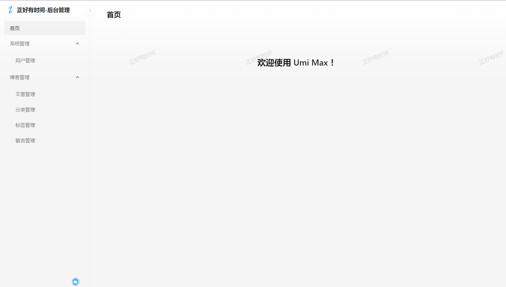

## 系统管理/用户管理

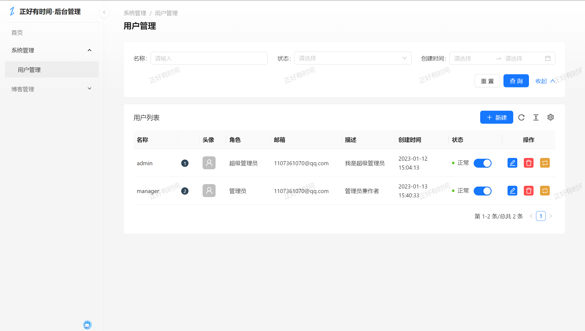

- [x] 添加用户

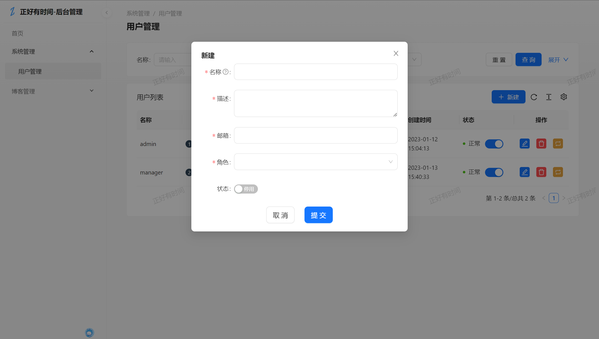

- [x] 修改用户

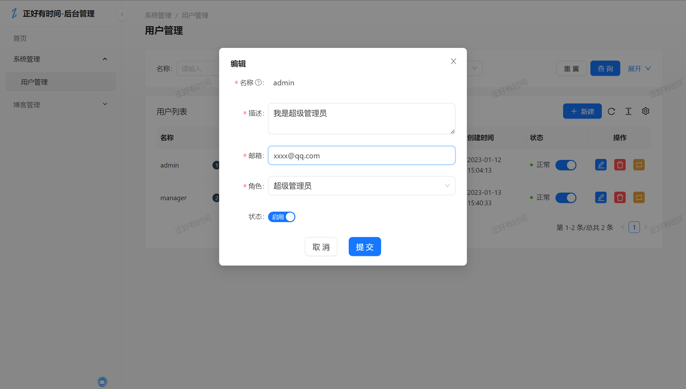

- [x] 删除用户
- [x] 停用用户
- [x] 重置用户密码

## 系统管理/web 用户管理

- [ ] 用户列表

## 系统管理/浏览日志

- [ ] 博客门户日志
- [ ] 后台登录日志

## 博客管理/文章管理

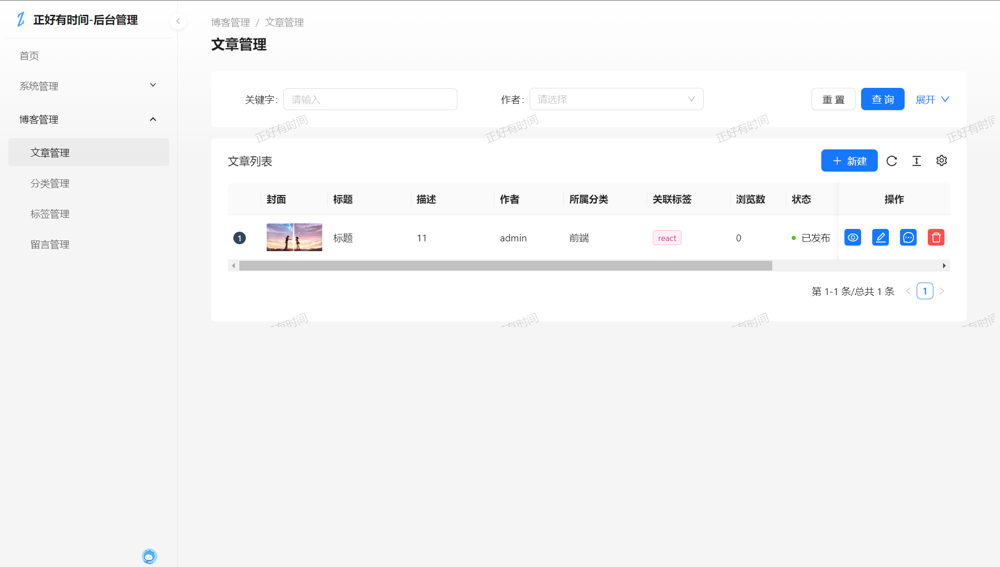

- [x] 新增文章

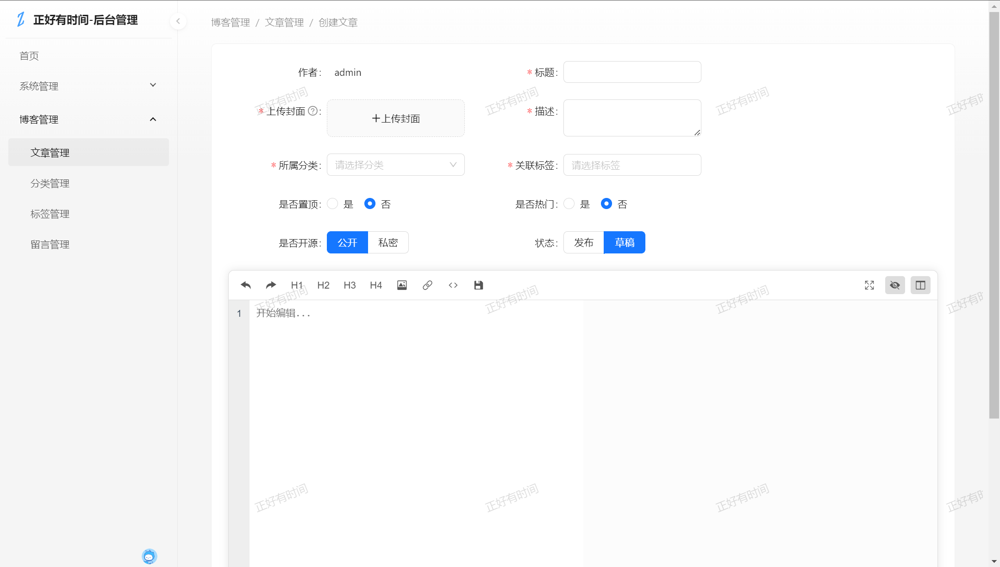

- [x] 修改文章

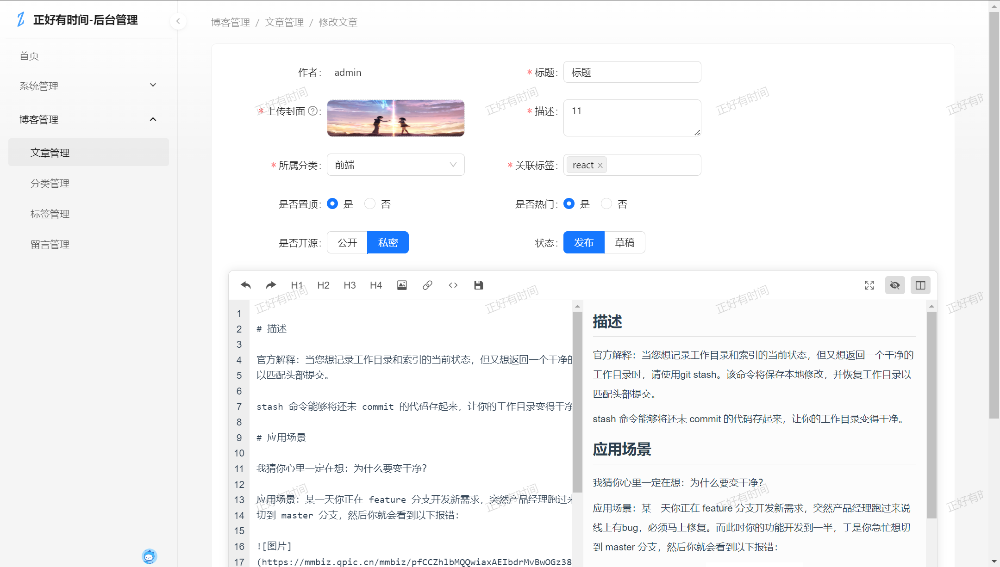

- [x] 文章详情

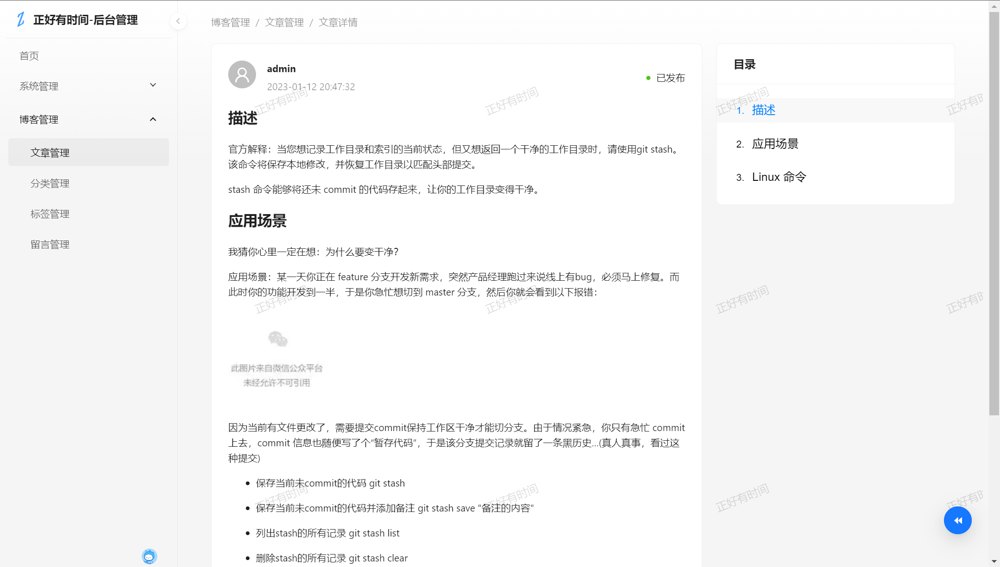

- [x] 查找文章

- [x] 删除文章

- [ ] 文章评论

## 博客管理/分类管理

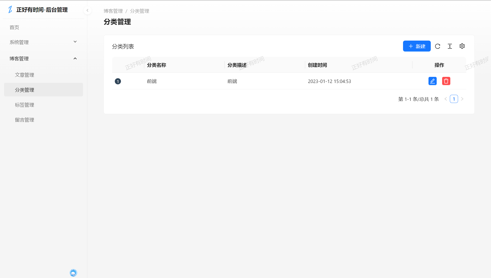

- [x] 新增分类

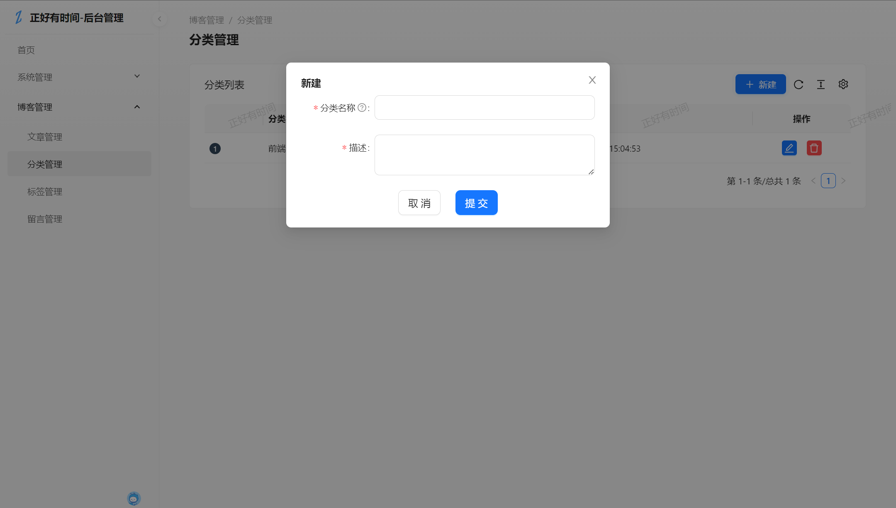

- [x] 修改分类

- [x] 删除分类

## 博客管理/标签管理

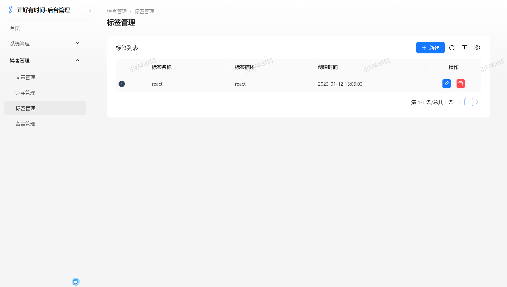

- [x] 新增标签

- [x] 修改标签

- [x] 删除标签

## 个人中心

- [ ] 修改头像
- [ ] 修改个人信息
- [ ] 修改密码

## 登录

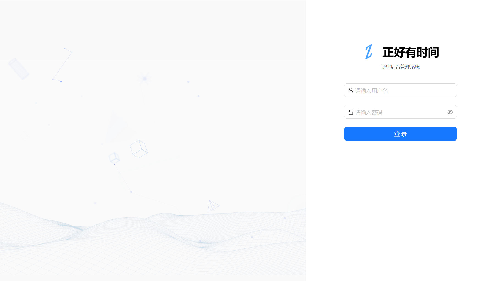

- [x] 正常登录
- [x] 校验用户状态(停用/启用)
- [ ] 登录验证码(防恶意攻击)

## 退出登录

- [x] 正常登出

## 权限设计(部分完成)

- 超级管理员(上帝视角)-增删改查所有模块

- 管理员/作者(供文章创作者使用)-增删改查所属自身数据

- 浏览者(供浏览系统使用)-查看所有模块数据
